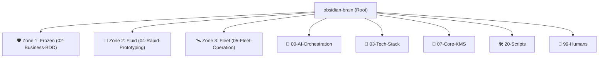

# 🌌 Analysis Report: Obsidian Brain Repository & Ecosystem Integration

This report provides a comprehensive analysis of the **`obsidian-brain`** repository, its internal structure, submodules, governance protocols, and its active role within the codebase visualizer.

---

## 🗺️ 1. Architecture & Vault Topology

The `obsidian-brain` is the central **Strategic Command Center** and **Knowledge Management System (KMS)** for the Bastien-Antigravity ecosystem. It operates under a **5D Paradigm** using a hybrid organization:

### The Three Operational Zones (To Prevent Mode Leakage):
1. **🛡️ Zone 1: Frozen (`02-Business-BDD`)**: Behavioral Source of Truth. Contains approved BDD specs (Gherkin format). Code changes are strictly forbidden without a corresponding specification defined here.
2. **🧪 Zone 2: Fluid (`04-Rapid-Prototyping`)**: Experimental Labs for rapid iteration, spikes, and MVP designs.
3. **🛰️ Zone 3: Fleet (`05-Fleet-Operation`)**: Command & Control center tracking fleet-wide action plans, deployment logs, and migration states.

---

## 🕹️ 2. Multi-Mode Governance Protocols

The behavior of agents and developer workflows are regulated by `00-AI-Orchestration/Config/MODE-MANUAL.md`.

*   **Mode 1: Spec-First (Active)**: No code changes without an approved BDD Spec. Prioritizes safety and zero-drift.
*   **Mode 2: Free-Labs**: Focuses on velocity. BDD specs are optional; graduation ceremonies transition verified prototypes to Mode 1.
*   **Mode 3: Agent Orchestrator**: Manages multi-repo synchronization and mass refactoring across the fleet using action plans.
*   **Mode 4: Direct-Action**: Stateless, quick tactical repairs, or Q&A.

---

## 📦 3. Git Submodule & Inventory Status

The repository lists several submodules to house external documentation repositories. 

| Directory | Submodule Repository | Branch | Status |
| :--- | :--- | :--- | :--- |
| **`01-Strategic-Nexus`** | `nexus-strategic-brain.git` | `develop` | ✔ Loaded & Initialized |
| **`02-Business-BDD`** | `business-bdd-brain.git` | `develop` | ✔ Loaded & Initialized |
| **`03-Tech-Stack`** | `tech-stack-brain.git` | `develop` | ✔ Loaded & Initialized |
| **`04-Rapid-Prototyping`** | `rapid-prototyping-brain.git` | `develop` | ✔ Loaded & Initialized |
| **`05-Fleet-Operation`** | `fleet-operation-brain.git` | `develop` | ✔ Loaded & Initialized |
| **`07-Core-KMS`** | `core-kms-brain.git` | `develop` | ✔ Loaded & Initialized |

> [!NOTE]
> The `08-RAG-Engine` repository (`obsidian-rag-mcp.git`) is registered in `inventory.json` but is not configured as a submodule in the local vault.

---

## ⚙️ 4. Integration with Codebase Visualizer

The `code-visualizer` microservice scans repositories defined in the `obsidian-brain/05-Fleet-Operation/00-Repo-Control/inventory.json` manifest.

### Resolve of 404 Previews
Before the submodules were imported, requests to retrieve source file previews (such as `/api/v1/source/obsidian-brain/03-Tech-Stack/05-Project-Scripts/Build-Wrapper.py`) resulted in `404 Not Found` because the directories were empty placeholder targets. Now that the submodules are cloned, the visualizer can successfully locate and serve all files.

### Analyzer Execution Verification
We executed the core codebase analyzer engine on the updated workspaces. It completed successfully with the following metrics:
*   **Total Source Files Discovered**: 153 (78 `.py`, 31 `.rs`, 28 `.go`, 12 `.hpp`, 2 `.cpp`, 2 `.h`)
*   **Nodes Extracted**: 1,497
*   **Edges/Connections Resolved**: 2,203
*   **Output File**: `codebase_graph.json` (1.7 MB)

---

## 📅 5. Active Mission & Session History

Per the `AI-Session-State.md`, the current active state is:
*   **Mission ID**: `KMS-FIX-AUTOGEN`
*   **Active Protocol**: `Mode 1` (Spec-First)

### Recent Activity Logs:
*   **2026-05-16**: Modernized AI squad roles, implemented transitive Tag Taxonomy, consolidated templates to `00-AI-Orchestration/Templates/`, and streamlined vault layout.
*   **2026-05-15**: Standardized all fleet repositories to track `develop` and updated `fleet-manager.py` to auto-resolve detached HEAD states.
